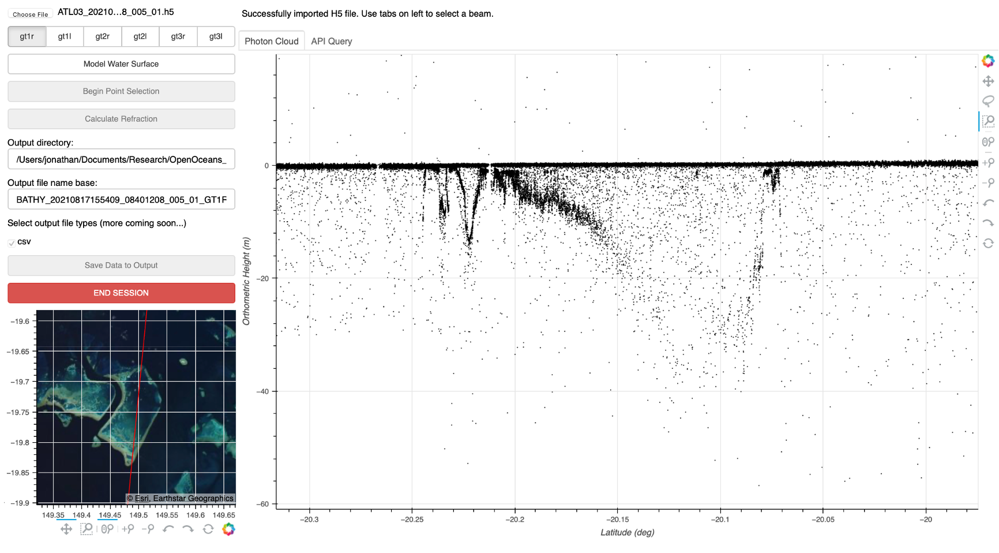
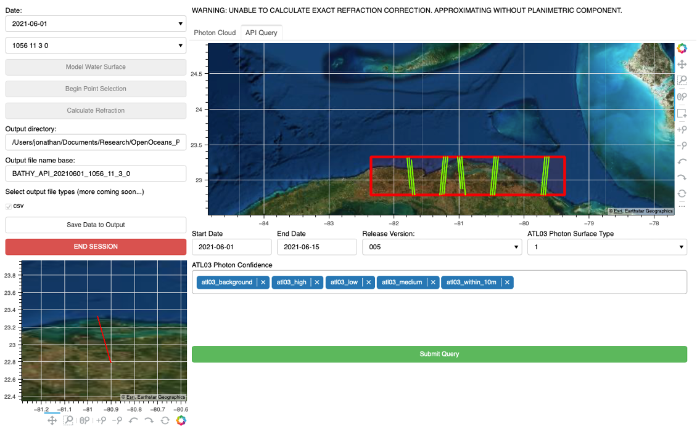
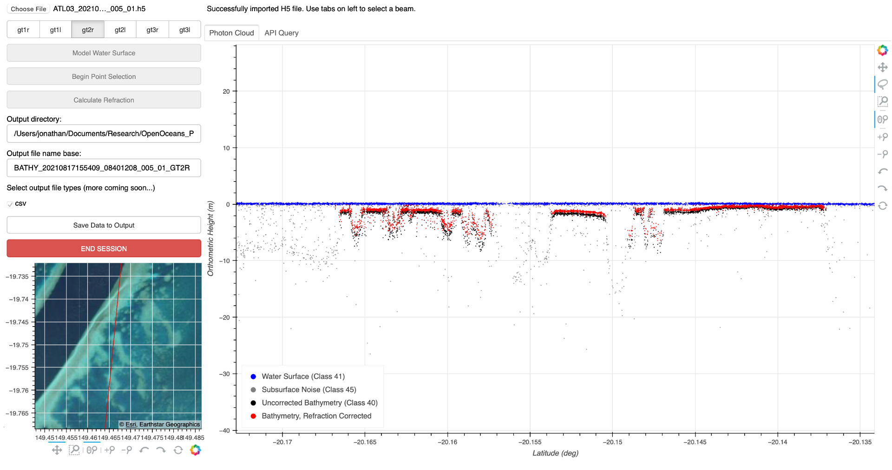

# OpenOceans 

OpenOceans is a repository of tools for ICESat-2 bathymetry science.

You've found this while its still under development! You will almost certainly find a bug or two, feel free to submit an issue.    

Made with ❤️ and ☕️ by:

__Jonathan Markel__<br />
Graduate Research Assistant<br /> 
3D Geospatial Laboratory<br />
The University of Texas at Austin<br />
jonathanmarkel@gmail.com<br />

## Labeling Tool
ICESat-2 data is provided as individual transects of photon-counting lidar returns. Point cloud features such as ground, canopy, sea surface, and bathymetry are easily distinguished by humans, but automated methods of feature extraction are still an open area of research. 

This tool can be used to 
- select bathymetric returns in ICESat-2 data
- model water surface returns
- apply depth corrections to account for water refraction

Data can be read in from a locally stored ATL03 H5 file or using API querying.

### Installation
The labeling tool is almost entirely contained within the `manual_tool.py` Python script. However, there are several  Python packages that are required to run this script.

It's recommended to use conda or a similar package manager for configuring a development environment. Once conda is configured for your system, you can use the `environment.yml` file included in this repository and the following command to create a conda environment called 'openoceans' with the required dependencies.

```
conda env create -n openoceans --file environment.yml
```

### Running the Tool
The OpenOceans manual labeling tool is implemented as a [bokeh](https://docs.bokeh.org/en/latest/index.html) app which can be run from the terminal with a single command.

```
bokeh serve --show manual_tool.py --websocket-max-message-size=300000000
```

What is this actually doing? The command `bokeh serve --show manual_tool.py` initializes a bokeh server to run the app within the python script `manual_tool.py` and shows the app in the browser window. 
ICESat-2 ATL03 data files can also be relatively large - commonly containing hundreds of MB or several GB of photon data. However, bokeh servers are not configured to read in large amounts of local data so we increase the maximum allowed file size to 3GB with `--websocket-max-message-size=300000000`.

### Labeling Photon Data

The tool window can be broken up into several key elements. 
1. The upper left contains an assortment of buttons for input/output, point selection, refraction, and other data manipulation tools. 
2. The larger __Primary__ window is multi-purpose, depending on the tab selected. 
    - *Photon Cloud*. This tab shows the photon/elevation data for whichever file the user selects. This is also where the user will select bathymetric returns and visualize refraction corrected data before saving any output. 
    - *API QUERY*. This tab allows the user to query NASA servers by selecting a bounding box and more. 
3. Above the primary window is a __Status Update__ box for communicating important information to the user. 
4. On the bottom left is the __Preview__ window, which will display the selected ICESat-2 track over an imagery basemap. This will dynamically update with the primary window.



#### Using ATL03 H5 Files
ICESat-2 photon elevation data is typically provided by NSIDC and EarthData in the form of ATL03 H5 files. These files can be read into the labeler from local storage using the `choose file` input button in the upper left upon start up. This may take a moment for larger files, and the terminal will show an updating progress bar as each of the 6 beams are loaded. Once all data has been read, the user will be able to select a beam ('gt1r', 'gt2l', etc...) from the buttons on the top left of the window. Selecting a profile will load the corresponding photon data into the __Primary__ window.

#### Using API Querying
Alternatively, it can also be useful to pull ICESat-2 data from NASA servers, rather than storing it locally. This can be done using the API QUERY functionality built into the OpenOcean manual labeling tool. 

> TIP: Using the API query can take a long time depending on the size of your query, your network connection, your computers memory, and more. It is **highly** recomended to start with a relatvely small bounding box and time window (several weeks to a month) first before making larger data requests. When in doubt, only download what you need!



0. Select the *API QUERY* tab. Note that this tab contains an __Bounding Box Selection__ imagery window - this is separate from the __Preview__ window. Also, the `choose file` button has been replaced with two drop down menus to select by a profile's overpass date and by more detailed track info, including the reference ground track (RGT), cycle number, beam pair, and beam track.

1. Zoom to Area of Interest. Use the Pan, Box Zoom, or Wheel Zoom tools to the right of the __Bounding Box Selection__ window to navigate to the desired area of interest.

2. Drawing a bounding box. Select the Box Edit Tool from the tool list on the right. Hold down shift while using the mouse to draw the bounding box. This box can be redrawn as needed, but only the latest bounding box is used for the actual query.

3. Refine query parameters. Use the start and end date fields to set a time window for your query. The default options for release, surface type, and photon confidence should be sufficient for the majority of use cases. If you think you may need to change these, check out the documentation for [SlideRule](http://icesat2sliderule.org/rtd/) and the [ATL03 data dictionary](https://nsidc.org/data/atl03) technical reference for more details.

4. Click the Submit Query button to start downloading data. It is very likely that this will take at least several minutes, so please be patient! Once all the requested photon data has been downloaded, it is reformatted and the tracks are plotted in the same window as the bounding box.

5. Select an ICESat-2 profile. Hovering the mouse over the new tracks in your bounding box will tell you which date, reference ground track (RGT) and other details correspond to that specific profile. These details have been populated in the two drop down windows on the left ('Date', and 'RGT, CYCLE...'). Selecting a specific profile will load the photon data into the Photon Cloud tab.

#### Water Surface Modeling
Once an ICESat-2 profile has been successfully loaded into the Photon Cloud window, the button to `Model Water Surface` is available to click. Activating this button will overlay a green line over the approximate water surface. 

An estimate of the local water surface is needed to calculate the water depth and the refraction correction. There are many ways to determine this water surface value - taking into account features like waves, tides, and more. However, this work has been focused on the developing basic labeling capabilities, and thus we use a simplified water surface model as follows:

- Step along track at ~20m intervals.
- At each step, collect all photons within 400m on either side (total of 800m along track processing chunks).
- Compute a histogram for all elevation data in this chunk, at 0.1m resolution.
- The center of the elevation bin with the most photons is determined to be the elevation of the water surface.

This is a highly simplified model of the water surface that is prone to oversmoothing waves, classifying land as water surface, and mislabeling noise as the surface when lacking a strong return. However, given that we are interested in bathymetry - where it is required that a strong water surface return exists above a seabed return - this approach is generally okay for calculating depths in open water and more than 400m off shore in the along track direction.

#### Seabed Point Selection
Click `Begin Point Selection` to begin the step of labeling seabed photons. This will temporarily remove all data above and within the water surface. 

Click the Lasso Tool on the right of the photon cloud. Click and drag the mouse to encircle any seabed returns for which you would like to calculate refracted depths. Repeat this step while holding down Shift to make multiple selections. When you are satisfied with your selection, continue on to the refraction correction step. 

#### Refraction Correction
The refraction of light when passing between mediums means that the underwater photon depths measured by ICESat-2 are not accurate like above water data - we must apply a refraction correction. The magnitude of this correction is determined by several factors including the spacecraft orientation, salinity of the water, and most importantly the height of the water surface. 

When available, the spacecraft orientation parameters *ref_azimuth* and *ref_elevation* are used in the refraction correction. These are generally available when ATL03 H5 files have been downloaded already from NSIDC or NASA EarthData.  However, API Querying is not currently able to return these parameters. When they are unavailable, a first order approximation is used to calculate the refraction correction which does not account for spacecraft geometry. In most cases, the loss of fidelity due to this approximation is negligible - errors are instead driven by the accuracy of the water surface model. 

Clicking the `Calculate Refraction` button computes this correction (or approximation thereof) as described in [Parrish et al 2019](https://doi.org/10.3390/rs11141634). 



#### Output Data
Output filenames are automatically generated from track info such as the date and ground track. However, these can be manually set by the user prior to saving the output. Similarly, unless reset by the user, data will be saved to the directory from which the app was originally run. 

Photon data corresponding to water surface, seabed, and subsurface (no bottom detected) labels are output to a CSV when the user clicks `Save Data to Output`. This button will turn green when data has been saved. 

For seabed classified photons, the output data includes the column ‘dZ’, which can be added to the ‘height’ or ‘height_ortho’ columns to get refraction corrected depths referenced to WGS84 or EGM08, respectively. 
